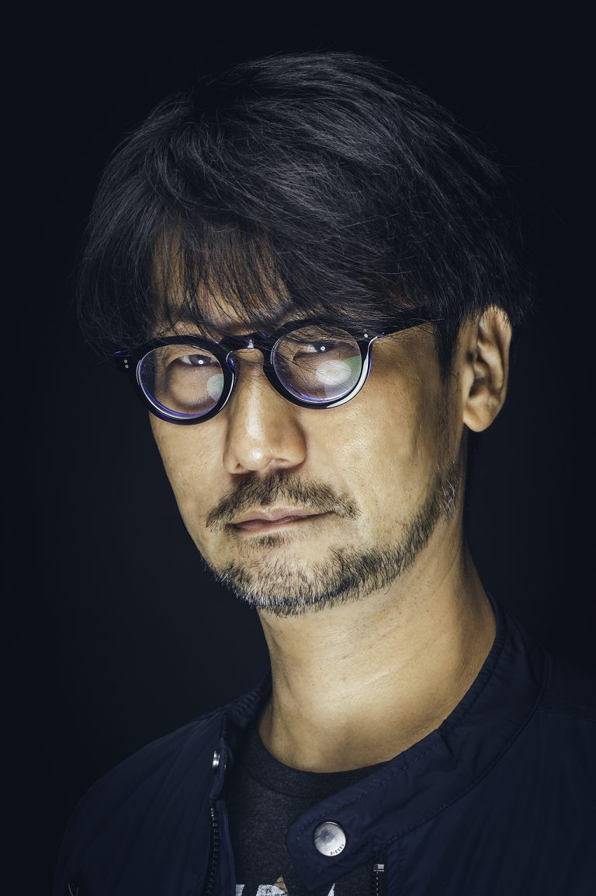
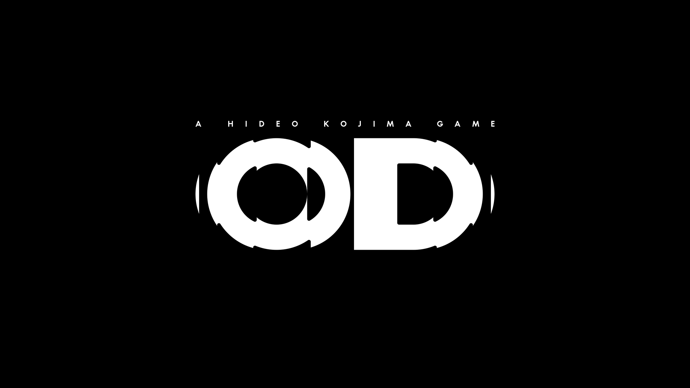
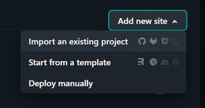
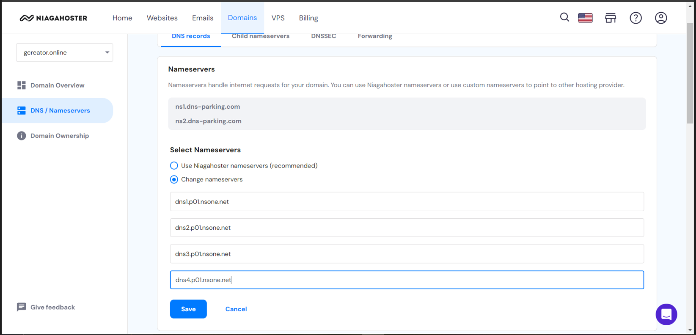
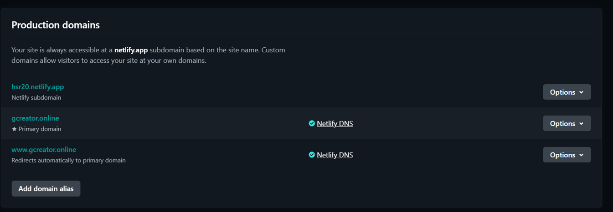

# Kojima Production Company Profile Website

## This project is to create a company profile page using HTML and CSS, ensuring responsive design across different screen devices and deploying it to a custom domain.

# Website Content Preview

For this website, this is the content that I will be using for the company profile website.

Company|Kojima Production

- [HOME](#)
- [NEWS](#)
- [PRODUCTS](#products)
- [CAREERS](#team)
- [STORE](#)

# Kojima Production

A MESSAGE FROM STUDIO FOUNDER, HIDEO KOJIMA

From Sapiens to Ludens  
We are Homo Ludens (Those who Play).

From the moment we enter this world,  
We instinctively invent ways to have "fun",  
and share our inventions with those around us.  
We are not asked to do this,  
nor do we need reasons to create.  
It is simply who we are.

We find one another and compete with one another.  
We laugh together and cry together: all while playing together.  
Our experiences bind us and liberate us.  
To share our most valuable experiences,  
we create stories, invent tools, and evolve the art of play.  
Play has been our ally since the dawn of civilization.

"Playing" is not simply a pastime,  
it is the primordial basis of imagination and creation.  
Truth be told, Homo Ludens (Those who Play) are  
simultaneously Homo Faber (Those who Create).

Even if the Earth were stripped  
of life and reduced to a barren wasteland, our imagination and desire  
to create would persevere beyond survival,  
it would provide hope that flowers may one day bloom again.  
Through the invention of play, our new evolution awaits.

KOJIMA PRODUCTIONS  
We are Homo Ludens. We are those who play.

## Hideo Kojima

# Meet Our Staff

# Hideo Kojima

## CEO & Founder

Coen Gabrielle  
&  
Thomas Kobayashi
=====================================

## Art Team

Xuanyi Li  
&  
Tetsuya Chiba
=============================

## Designer Team

Akio Sakamoto

================

## HR Director

# Our Journey

## TOMORROW IS IN YOUR HANDS.

In the near future, mysterious explosions have rocked the globe, setting off a series of supernatural events known as the Death Stranding. With otherworldly creatures plaguing the landscape, and mass extinction imminent, it’s up to Sam Porter Bridges to travel across the ravaged wasteland and save humanity from impending annihilation.

## SHOULD WE HAVE CONNECTED ?

Embark on an inspiring mission of human connection beyond the UCA. Sam—with companions by his side—sets out on a new journey to save humanity from extinction. Join them as they traverse a world beset by otherworldly enemies, obstacles and a haunting question: should we have connected? Step by step, legendary game creator Hideo Kojima changes the world once again.

# Death Stranding 2

# Death Stranding Directors Cut

# Death Stranding

# OD

- [FAQ](#)
- [Terms of Use](#)
- [Cookie Policy](#)
- [Contact Us](#)

© KOJIMA PRODUCTIONS Co., Ltd. 2022 All Rights Reserved

## Deployed Site:

[Link](https://gcreator.online/)

This is the link to the fully deployed Company Profile Website

# Making the company profile website

## Creating HTML

1. Create a index.html file
2. Make it Semantics, by using semantics tag such as header, nav, main, section, article, and footer to provide meaningful structure to the page.

3. Add the Assets that you need for the project, such as images and css files

4. Create the header section

5. Create sections for the main content of your website

6. Insert the main content of your website
7. Create the footer section

## Creating Responsive CSS Design

1. Create css file
2. Link the css file to the HTML file in the head section

3. Import custom font stylesheet to your HTML and CSS file

in HTML

in CSS

4. Create Navigation bar

5. Create grids container

6. Use media queries to make it responsive

## Setting up Github Repository

Open Computer Terminal and enter this command line

    cd ~your project directory
    git init
    git add .
    git commit -m "your message"
    git remote add origin the link copied from your github repository page
    git branch -m master main
    git push -u origin main

## Deployment Process

1. Make sure all your code is pushed up to Github on the branch you want to deploy e.g.`Main`
2. Navigate to https://app.netlify.com/
3. Login/Create an account with Github

4. Click `Add new site` and `Import an existing project`

5. Select `Deploy with Github`

6. Netlify will ask you to authenticate with GitHub
7. Select the repo that you want to deploy
8. Review the configurations as are shown below and click **Deploy "Site Name"**

9. Once deployed, Deployments are updated [triggered automatically](https://www.netlify.com/docs/continuous-deployment/) by every git push to the `main` branch of the origin repository.

### Setting up a custom domain

1. Navigate to https://app.netlify.com and select your site
2. Navigate to `Set up a custom domain`.
3. Add your custom domain to your site

4. Netlify will display a modal providing instructions on how to update your DNS/Nameservers
5. Update your DNS/Nameservers in the domain registrar site to the modal given by netlify

6. Wait for your external DNS/Nameservers to be verified

7. Once verified, visit your domain to verify that it's working

## Kojima Production Company Profile Website Should Be Up and Running!
